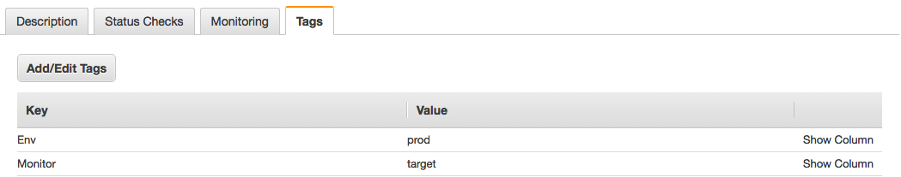
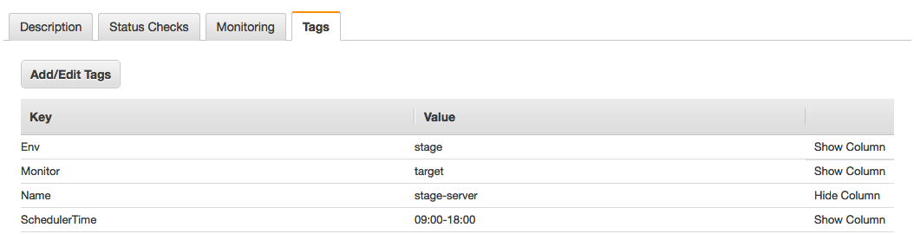
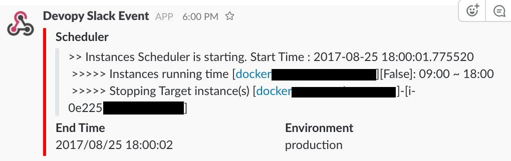
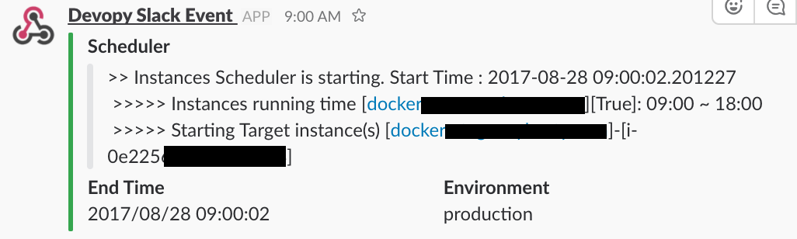
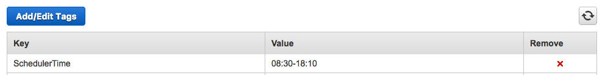
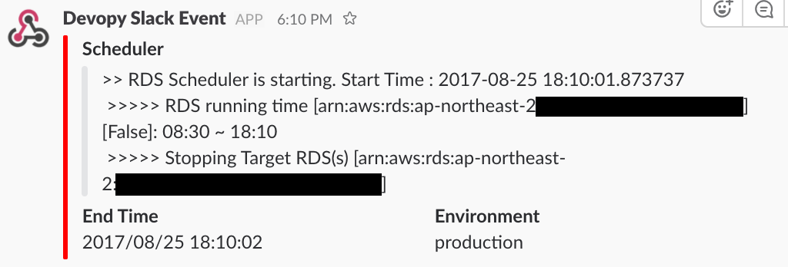
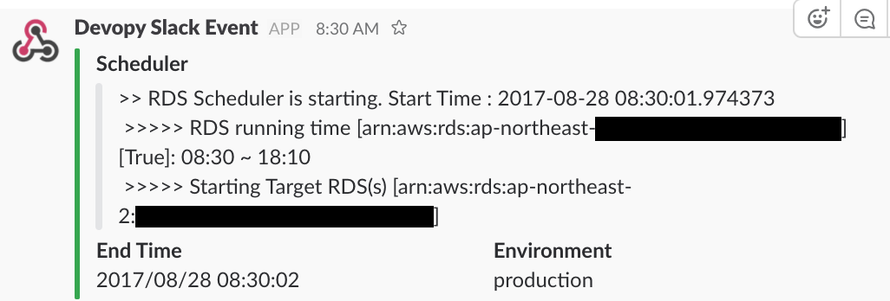

# Simple devops with python, on AWS
-----

* python 3.5.2
* boto3 1.4.6

Deployment on ApplicationLoadBalancer
-------------

Information of the target group to be distributed is searched, and distribution is performed rolling update one by one.
Check the following conditions.

* Deregistration delay
* health Status


Monitor disk volume usage of EC2 instances
-------------

Query the list of instances (use Tag to search only specific objects) and check disk usage.

1. Register **"Monitor" : "target"** in tags
2. Register scheduler using the crontab or jenkins job.

```bash
$ ./ec2_disk_usage.py --profile=foo --region=ap-northeast-2 --slack=https://..../xxx/yyy/zzz --pem=~/.ssh/foo.pem
```

* **EC2 instances tags configuration**

	


AWS resources start/stop schedulers
-------------

Schedule jobs to start and stop instances automatically to save cost.

1. Register **"schedulerTime"** in tags (hh:mm-hh:mm format).
2. Register scheduler using the crontab or jenkins job.

```bash
$ crontab -l

*/10 * * * * /var/www/schedulers/ec2.py --profile=foo --region=ap-northeast-2 --slack=https://hooks.slack.com/services/xxx/yyy
*/10 * * * * /var/www/schedulers/rds.py --profile=foo --region=ap-northeast-2 --slack=https://hooks.slack.com/services/xxx/yyy
```

## 1. EC2

* **EC2 instances tags configuration**

	

* **Notification to slack webhook**
	
	
	

## 2. RDS

* **RDS instances tags configuration**

	

* **Notification to slack webhook**
	
	
	